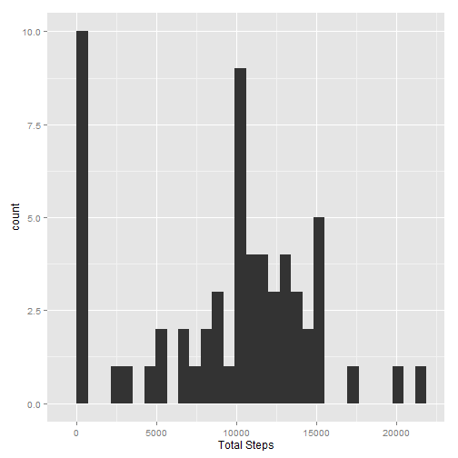

===================================
##Part1

After you've downloaded the zip file and unzipped it, you should have "activity.csv" in your working directory.  
Let's start off by loading the data from "activity.csv" and take a look at it.

```r
activity<-read.csv("activity.csv")
summary(activity)
```

```
##      steps                date          interval     
##  Min.   :  0.00   2012-10-01:  288   Min.   :   0.0  
##  1st Qu.:  0.00   2012-10-02:  288   1st Qu.: 588.8  
##  Median :  0.00   2012-10-03:  288   Median :1177.5  
##  Mean   : 37.38   2012-10-04:  288   Mean   :1177.5  
##  3rd Qu.: 12.00   2012-10-05:  288   3rd Qu.:1766.2  
##  Max.   :806.00   2012-10-06:  288   Max.   :2355.0  
##  NA's   :2304     (Other)   :15840
```
 
For the our purpose here, let's get rid of the NAs.

```r
complete<-complete.cases(activity)
act_comp<-activity[complete,]
summary(act_comp)
```

```
##      steps                date          interval     
##  Min.   :  0.00   2012-10-02:  288   Min.   :   0.0  
##  1st Qu.:  0.00   2012-10-03:  288   1st Qu.: 588.8  
##  Median :  0.00   2012-10-04:  288   Median :1177.5  
##  Mean   : 37.38   2012-10-05:  288   Mean   :1177.5  
##  3rd Qu.: 12.00   2012-10-06:  288   3rd Qu.:1766.2  
##  Max.   :806.00   2012-10-07:  288   Max.   :2355.0  
##                   (Other)   :13536
```
Now let's calculate the total steps taken each day.  
Let's also omit missing values here.

```r
sums<-tapply(act_comp$steps,act_comp$date,sum)
summary(sums)
```

```
##    Min. 1st Qu.  Median    Mean 3rd Qu.    Max.    NA's 
##      41    8841   10760   10770   13290   21190       8
```
For dates that only have 0 steps, the sum value for those dates gets calculated as NA. Let's change that to 0 instead.

```r
sums[is.na(sums)]<-0
summary(sums)
```

```
##    Min. 1st Qu.  Median    Mean 3rd Qu.    Max. 
##       0    6778   10400    9354   12810   21190
```

###Histogram for Part 1
So now that we've cleaned that up a bit, let's create a histogram for the total steps taken per day

```r
library(ggplot2)

sums_dat<-as.data.frame(sums)

g<-ggplot(sums_dat,aes(sums))
g<-g + geom_histogram()
g<-g + labs(x = "Total Steps")
g
```

```
## stat_bin: binwidth defaulted to range/30. Use 'binwidth = x' to adjust this.
```

 

###Mean and Median for Part 1
Let's see what the mean is of the total steps taken per day.

```r
mean(sums)
```

```
## [1] 9354.23
```
Let's also see the median.

```r
median(sums)
```

```
## [1] 10395
```
  
  

##Part 2

###Time Series Plot for Part 2
Let's plot average steps for each interval across all dates against the intervals.  
For the purpose of the plot, let's again use the act_comp data frame created in Part 1 which only includes complete cases.


```r
df<-aggregate(data=act_comp,steps~interval,mean)

gg<-ggplot(data=df, aes(x=interval,y=steps))
gg<-gg + geom_line(colour="blue")
gg<-gg + labs(x="Interval", y="Average Number of Steps")
gg
```

 

##Highest Average Number of Steps for Part 2
So which interval has the highest average number of steps?

```r
df[which(df$steps==
             max(df$steps)),
   ]$interval
```

```
## [1] 835
```
  
  

##Part 3
So how many rows have missing values?

```r
summary(activity)
```

```
##      steps                date          interval     
##  Min.   :  0.00   2012-10-01:  288   Min.   :   0.0  
##  1st Qu.:  0.00   2012-10-02:  288   1st Qu.: 588.8  
##  Median :  0.00   2012-10-03:  288   Median :1177.5  
##  Mean   : 37.38   2012-10-04:  288   Mean   :1177.5  
##  3rd Qu.: 12.00   2012-10-05:  288   3rd Qu.:1766.2  
##  Max.   :806.00   2012-10-06:  288   Max.   :2355.0  
##  NA's   :2304     (Other)   :15840
```
2304 rows according to the summary  

###Imputing the Data for Part 3
**Note that this is probably not going to be the most concise way of doing so  
So now let's impute the NAs. For our purpose here, I'll use the means based on the intervals.  
I'll start off by calculating the means and then merging it to the data frame as a new column. This new column appears as "steps.y"

```r
means<-aggregate(activity$steps,list(activity$interval),mean, na.rm=T)
colnames(means)<-c("interval","steps")
merged_dat<-merge(activity, means, by="interval")
summary(merged_dat)
```

```
##     interval         steps.x               date          steps.y       
##  Min.   :   0.0   Min.   :  0.00   2012-10-01:  288   Min.   :  0.000  
##  1st Qu.: 588.8   1st Qu.:  0.00   2012-10-02:  288   1st Qu.:  2.486  
##  Median :1177.5   Median :  0.00   2012-10-03:  288   Median : 34.113  
##  Mean   :1177.5   Mean   : 37.38   2012-10-04:  288   Mean   : 37.383  
##  3rd Qu.:1766.2   3rd Qu.: 12.00   2012-10-05:  288   3rd Qu.: 52.835  
##  Max.   :2355.0   Max.   :806.00   2012-10-06:  288   Max.   :206.170  
##                   NA's   :2304     (Other)   :15840
```
Now let's subset for just the rows with NAs.

```r
dat.na<-merged_dat[is.na(merged_dat$steps.x),]
```
Let's now cut the NAs out and create a data frame with the dates, intervals, and means

```r
library(dplyr)
dat.na.2<-select(dat.na, -steps.x)
dat.na.2<-rename(dat.na.2,steps=steps.y)
dat.na.2<-select(dat.na.2, steps, date, interval)
head(dat.na.2)
```

```
##       steps       date interval
## 1  1.716981 2012-10-01        0
## 11 1.716981 2012-11-04        0
## 32 1.716981 2012-11-30        0
## 41 1.716981 2012-11-14        0
## 45 1.716981 2012-11-09        0
## 49 1.716981 2012-11-01        0
```
And now, let's combine this data frame to the act_comp data frame previously created (again, this is just the original data frame with complete cases)

```r
act.2<-rbind(act_comp,dat.na.2)
summary(act.2)
```

```
##      steps                date          interval     
##  Min.   :  0.00   2012-10-01:  288   Min.   :   0.0  
##  1st Qu.:  0.00   2012-10-02:  288   1st Qu.: 588.8  
##  Median :  0.00   2012-10-03:  288   Median :1177.5  
##  Mean   : 37.38   2012-10-04:  288   Mean   :1177.5  
##  3rd Qu.: 27.00   2012-10-05:  288   3rd Qu.:1766.2  
##  Max.   :806.00   2012-10-06:  288   Max.   :2355.0  
##                   (Other)   :15840
```

###Histogram for Part 3
Let's now see what the total steps per day looks like.

```r
sums.2<-as.data.frame(tapply(act.2$steps,act.2$date,sum))
colnames(sums.2)<-"sums"

library(ggplot2)
g<-ggplot(sums.2,aes(sums))
g<-g + geom_histogram()
g<-g + labs(x = "Total Steps")
g
```

```
## stat_bin: binwidth defaulted to range/30. Use 'binwidth = x' to adjust this.
```

 

What does the mean look like now?

```r
mean(sums.2$sums)
```

```
## [1] 10766.19
```

What does the median look like now?

```r
median(sums.2$sums)
```

```
## [1] 10766.19
```
With the imputed data, both the mean and median are noticeable higher than when NAs were simply dropped
  
  

##Part 4
Let's add a new column to the data frame that shows whether the date is during the week or weekend.  
They should be factor variables

```r
library(dplyr)
act.2.days<-mutate(act.2,
                   day=weekdays(as.POSIXct(activity$date)))

act.2.days$day[which(act.2.days$day=="Monday")]<-"weekday"
act.2.days$day[which(act.2.days$day=="Tuesday")]<-"weekday"
act.2.days$day[which(act.2.days$day=="Wednesday")]<-"weekday"
act.2.days$day[which(act.2.days$day=="Thursday")]<-"weekday"
act.2.days$day[which(act.2.days$day=="Friday")]<-"weekday"
act.2.days$day[which(act.2.days$day=="Saturday")]<-"weekend"
act.2.days$day[which(act.2.days$day=="Sunday")]<-"weekend"

act.2.days$day<-as.factor(act.2.days$day)

summary(act.2.days)
```

```
##      steps                date          interval           day       
##  Min.   :  0.00   2012-10-01:  288   Min.   :   0.0   weekday:12960  
##  1st Qu.:  0.00   2012-10-02:  288   1st Qu.: 588.8   weekend: 4608  
##  Median :  0.00   2012-10-03:  288   Median :1177.5                  
##  Mean   : 37.38   2012-10-04:  288   Mean   :1177.5                  
##  3rd Qu.: 27.00   2012-10-05:  288   3rd Qu.:1766.2                  
##  Max.   :806.00   2012-10-06:  288   Max.   :2355.0                  
##                   (Other)   :15840
```

So how do the number of steps differ from the weekdays to the weekends?  
Let's first calculate the average number of step per interval accross all days, but let's calculate these separately for weekdays and weekends.

```r
act.2.wd<-act.2.days[which(act.2.days$day=="weekday"),]
act.2.we<-act.2.days[which(act.2.days$day=="weekend"),]

df2.wd<-as.data.frame(aggregate(data=act.2.wd,steps~interval,mean))
df2.wd<-mutate(df2.wd,day="weekday")
df2.wd$day<-as.factor(df2.wd$day)

df2.we<-as.data.frame(aggregate(data=act.2.we,steps~interval,mean))
df2.we<-mutate(df2.we,day="weekend")
df2.we$day<-as.factor(df2.we$day)
```

###Panel Plot for Part 4
Now that we've calculated the averages, let's compare them on a panel plot


```r
df2<-rbind(df2.wd,df2.we)
##So that ggplot can create the two panels we need to combine the weekday and weekend means into one data frame.

library(ggplot2)

ggg<-ggplot(data=df2, aes(x=interval,y=steps))
ggg<-ggg + geom_line(colour="blue")
ggg<-ggg + labs(x="Interval", y="Average Number of Steps")
ggg<-ggg + facet_grid(day~.)
ggg
```

 
